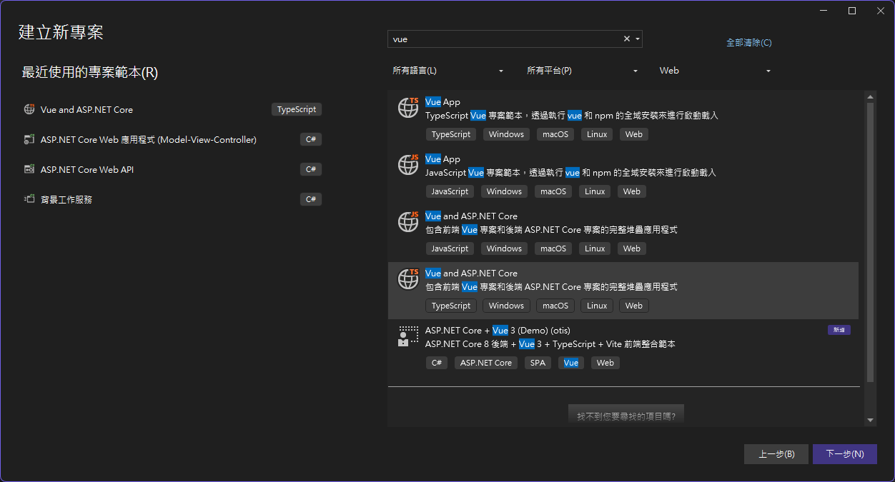
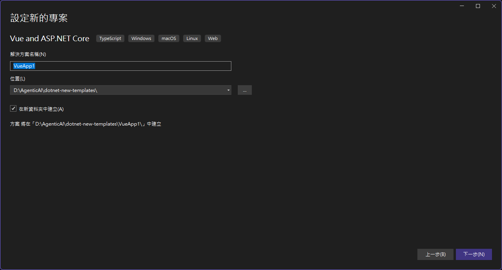
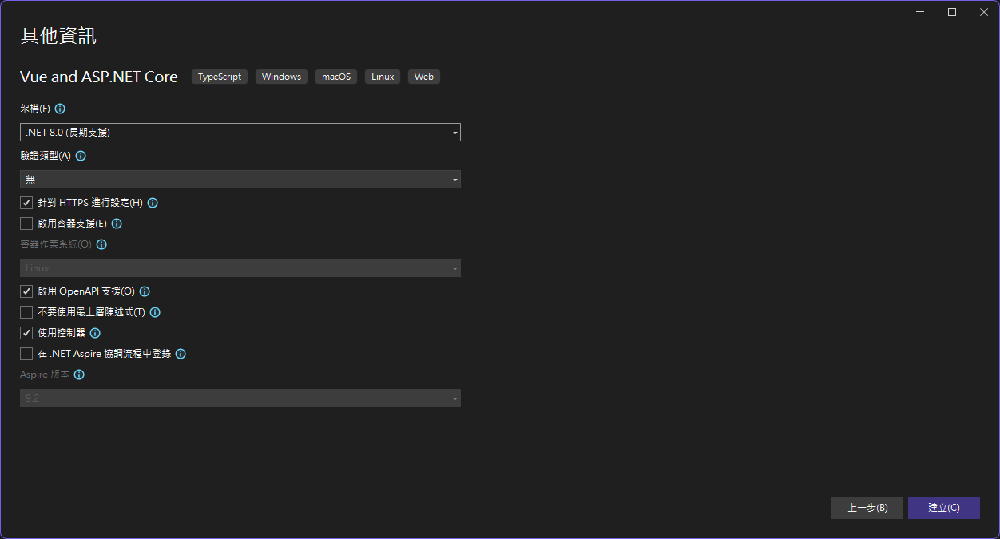

# dotnet-new-templates

自訂 `dotnet new` 專案範本集合。

> 參考：[dotnet new 的自訂範本 — Microsoft Learn](https://learn.microsoft.com/zh-tw/dotnet/core/tools/custom-templates)

---

## 安裝方式

Clone 此儲存庫後，進入對應範本目錄安裝：

```bash
git clone <this-repo>
cd dotnet-new-templates
dotnet new install .\<範本目錄>
```

安裝完成後，使用 `dotnet new <簡短名稱> -n <專案名稱>` 建立新專案。

---

## 範本清單

| 範本名稱 | 簡短名稱 | 語言 | 標記 |
|---------|---------|------|------|
| ASP.NET Core + Vue 3 (Admin) | `vue-app-admin-dotnet8` | [C#] | Web/SPA/Vue/ASP.NET Core |
| ASP.NET Core + Vue 3 | `vue-app-demo` | [C#] | Web/SPA/Vue/ASP.NET Core |

---

## 可用範本

### vue-app-admin-dotnet8

以 `vue-app-demo` 為基礎，加入後台管理系統完整骨架的全端專案範本。

**前端**

- Vue 3（Composition API）+ TypeScript
- Vite 8，`/api` proxy，HTTPS dev cert 自動產生
- Pinia（含 auth-store、user-info-store，含 loading / error state）
- Vue Router 5，含 beforeEach 登入守衛、404 catch-all、document.title 更新
- PrimeVue 4（Aura theme）+ Bootstrap 5 + Bootstrap Icons + FontAwesome 7
- Vee-Validate + Yup 表單驗證
- 集中式 axios instance（Bearer token 自動注入、ApiResponse<T> unwrap、401 自動登出）
- Feature-level API modules（`src/api/`）+ server 合約 TypeScript 型別（`src/types/api.ts`）

**後端**

- ASP.NET Core Web API（.NET 8）
- JWT Bearer 認證（`AuthController`、`JwtService`、`AuthService`）
- Serilog（Console + rolling file，`.txt` 與 `.json`）
- Feature-based 垂直切片架構（`Features/<feature>/`）
- Request / Response 分層結構
- ExampleItems Controller + Service（hardcoded dummy data 示範分層）
- Swagger 含 JWT Bearer security definition
- 統一 `ApiResponse<T>` 回應包裝格式

**測試**

- xUnit 測試專案（`VueAppAdmin.Server.Tests`）
- NSubstitute mock 框架
- Coverlet 程式碼覆蓋率收集

**開發體驗**

- 登入後進入 MainLayout（Header + Sidebar 從 `router meta.showInSidebar` / `sidebarIcon` 自動衍生）
- 帳號 `admin` / 密碼 `password`（範本用，實際使用請替換）
- `appsettings.json` 的 `Jwt:SignKey` 需替換為正式金鑰

**前置需求**

- [.NET 8 SDK](https://dotnet.microsoft.com/download/dotnet/8.0)
- [Node.js](https://nodejs.org/) >= 20.19.0

**安裝**

```bash
dotnet new install .\vue-app-admin-dotnet8
```

**建立新專案**

```bash
dotnet new vue-app-admin-dotnet8 -n MyApp
cd MyApp
dotnet run --project MyApp.Server
```

---

### vue-app-demo

以 Visual Studio 內建的 **Vue 和 ASP.NET Core** 專案類型為基礎，擴充額外工具鏈的全端專案範本。





**前端**

- Vue 3（Composition API）
- Vite 8，支援 HMR 熱更新
- TypeScript
- ESLint + oxlint

**後端**

- ASP.NET Core Web API（.NET 8）
- Swagger / OpenAPI

**開發體驗**

- 一個 `dotnet run` 同時啟動前後端
- Vite 開發伺服器透過 SpaProxy 將 API 請求代理至 ASP.NET Core
- 透過 `dotnet dev-certs` 自動設定 HTTPS

**前置需求**

- [.NET 8 SDK](https://dotnet.microsoft.com/download/dotnet/8.0)
- [Node.js](https://nodejs.org/) >= 20.19.0

**安裝**

```bash
dotnet new install .\vue-app-demo
```

**建立新專案**

```bash
dotnet new vue-app-demo -n MyApp
cd MyApp
dotnet run --project MyApp.Server
```

---

## 維護筆記

### `Microsoft.VisualStudio.JavaScript.Sdk` 版本

各範本的 `*.client.esproj` 中有一行：

```xml
<Project Sdk="Microsoft.VisualStudio.JavaScript.Sdk/1.0.2752196">
```

這個版本號跟著 Visual Studio 安裝器走，**不會自動更新**。建議在 VS 升級後手動確認：

1. 在 VS 建立任意 TypeScript 或 JavaScript 專案
2. 開啟產生的 `.esproj`，比對版本號
3. 若有新版本，更新此 repo 中所有 `.esproj` 的版本號

或直接查 NuGet：搜尋 `Microsoft.VisualStudio.JavaScript.Sdk` 取得最新版本。

舊版本向後相容，不急著更新，定期（每次 VS 大版升級後）確認即可。
